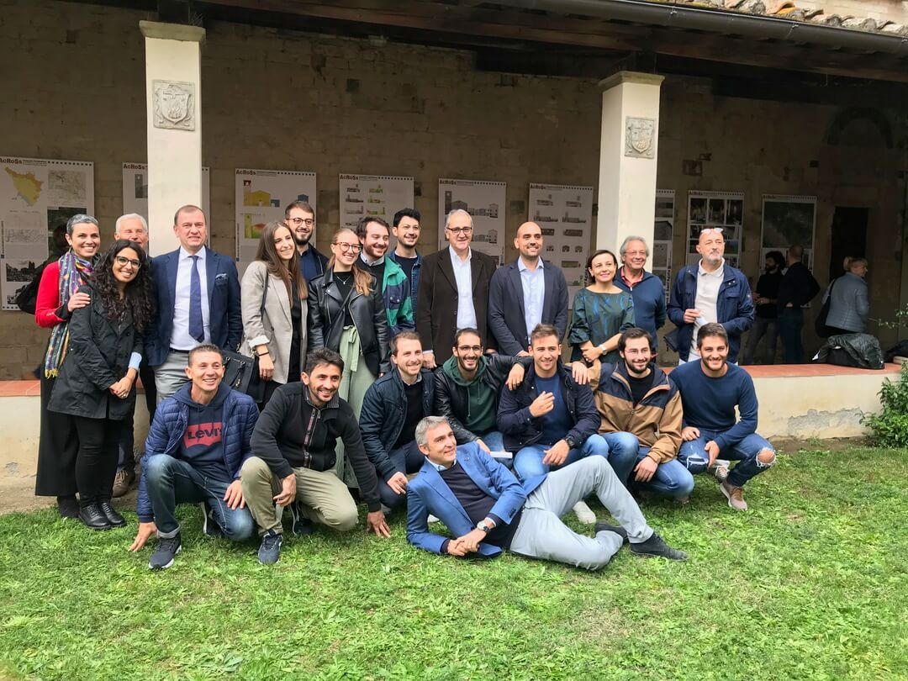

# Outreach Meeting

### Sant'Agata del Mugello October 19 2019

The town hall of Scaperia e San Piero sponsored an outreach event, held in October 2019 in the church of Sant’Agata, to present the project to the local population and to hare with them the main results of
this study. 
Andrea Arrighetti, Emma Cantisani, Fabio Fratini, Giovanni Minutoli and Maria Lancieri animated the round table with the population.

A series of talk were given to introduce the project and the results.

An exibition with scientific poster was held in the parrish cloister

Students from Siena and Florence university were involved in the project

Tommaso Francucci realised a video to explain the measures surveys and the aim of the project

[Video](https://youtu.be/JPLIgqQgP-4)

