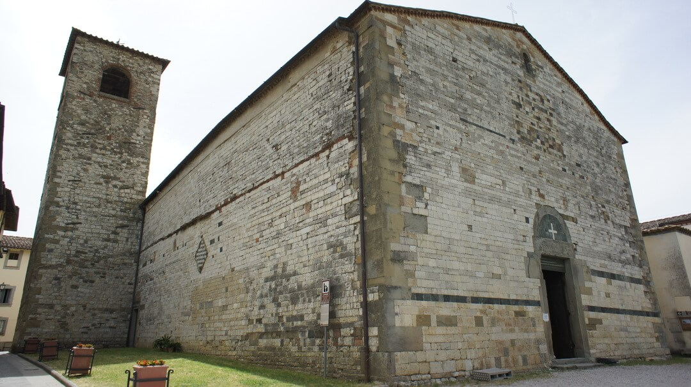

# The Pieve of Sant'Agata

The Sant’Agata del Mugello church is a Romanesque church located in the Mugello basin (Italy, Tuscany) and suffered from many earthquakes at least from 1542 (Io 9, M 6.02).
The Parish church has been partially studied in preliminary studies (Tesi di Andrea Arrighetti) according to the so-called "archaeologia dell’architettura" method. The Arighetti previous stratigraphic analysis included the facade of the church, the north-facing outside wall of the nave and the west-facing outside wall of the bell tower. Montabert et al 2020 extended the work to the entire church using the [RECAP method](http://recap.huma-num.fr/webpublic/?lang=fr).

The results are published in:

***[Tracing the seismic history of Sant’Agata del Mugello (Italy, Tuscany) through a cross-disciplinary approach](https://hal.archives-ouvertes.fr/hal-02944920)***

The church of Sant’Agata is an exceptional working laboratory since the repair operations are still visible and the existence of exceptional historical documents like Nozzolini’s log book allows to corroborate the information obtained from stratigraphic analysis. Such an extraordinary richness of information is mainly due to the Sant’Agata population who is strongly engaged into the preservation of its heritage. Indeed, the town hall of Scaperia e San Piero sponsored an outreach event, held in October 2019 in the church of Sant’Agata, to present the project to the local population and to hare with them the main results of
this study. 

[Outreach in Sant'Agata](outreach)

