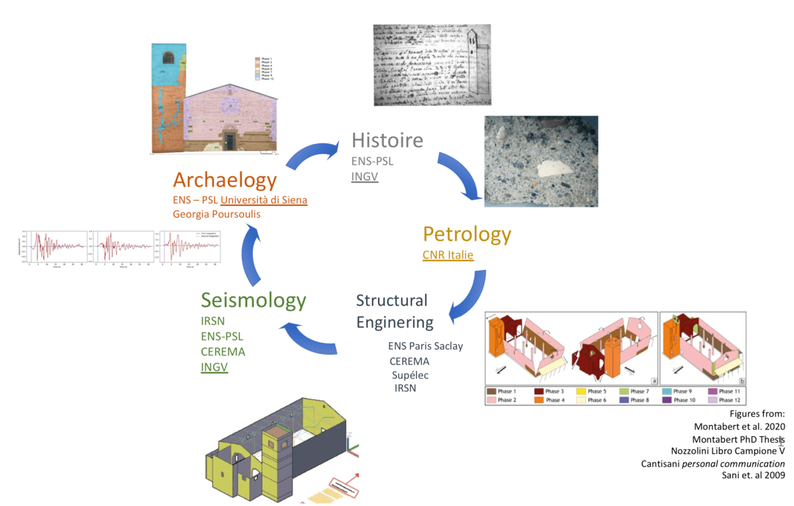

# About

## Monuments as stone seismometer

Historical earthquake catalogues are one of the building blocks for the assessment of seismic hazard. In spite of many years of research in the archives, many earthquakes remain poorly known. New sources of information are hence required.

Among these, historical buildings are witnesses of natural catastrophes recorded in their walls as structural disorders, repairs, restorations.

The ambition of this project is to study past earthquakes using buildings as “stone seismometers”, analysing the seismic ground motions required to explain building repairs/disorders, or their absence. To gain such a knowledge on past ground motions, it is necessary to define an interdisciplinary strategy based on: innovative techniques to inventory repairs introduced in the building archaeology; realistic seismic input signals consistent with the seismotectonic context; digital building models implementing realistic geometry and construction materials as well as robust modelling of masonry behaviour.

With this aim, a methodology connecting “ArChaeology, inventory of RecOnstruction, Seismology and Structural engineering” (ACROSS) is introduced.

The project goal is to demonstrate that archaeological characterization of post-seismic repairs on buildings can be successfully used to infer key ground motion and earthquake source characteristics of historical earthquakes

## The main step of ACROSS method
The ACROSS method is declined in five steps, each of them challenging the concerned disciplines to use methods and technics at the state of the art and to strongly interact among them to obtain reliable outcomes, useful for all the involved communities.

- Collecting the data produced by the archaeology of the buildings and the study of historical sources. The archaeological analysis follows the [RECAP (REConstruire APrès un séisme)](http://recap.huma-num.fr/webpublic/?lang=fr) protocol devoted to: identify and locate buildings repairs and damages; characterize the repairs; establish chronological relationships among the different repairs and between each repair and the various types of building techniques. The mineralogical and petrographic analysis of mortars is used to confirm or disprove the proposed relative chronological order of building phases. Repairs result both from destruction induced by natural and/or anthropic catastrophes or building expansion/reconfiguration. An in-depth study of historical records can deliver information on the occurrence of these circumstances, their impact on the building and on the associated restorations, providing exact chronological markers. 
-	Identification of damage mechanisms. The description of the repairs (the shape, the building materials, the presence of tie bars and so on) is submitted to the expert opinion of engineers. The goal is to distinguish the structural disorders/repairs –coeval to earthquake occurrence– actually caused by the ground shaking from those related to other circumstances. The timeline of all building phases determined in first step is a valuable information to elaborate the numerical models of the building along the centuries allowing to take into account the past geometries and the evolution of construction materials.
-	Definition of the digital building model used to perform seismic dynamic analysis. A reliable simulation of the mechanical response of an existing masonry structure is based on detailed geometry and on reliable mechanical properties characterized through experimental tests. Both are challenging points. The model geometry is constrained by 3D laser scanner measures (plan, wall thickness), and by the archaeological analysis leading to draw the shape and define material of each building phase, including mortar properties.  The linear dynamic behaviour is constrained by operational modal analysis (OMA), while the description of the non-linear mechanical behaviour of masonry is based on dedicated material constitutive laws for the identified building technics. 
-	Definition of ground motions to be used as input for the building dynamic analysis. For the aim of the project, three-component ground motions are needed. They have to be representative of the tectonic and geological settings and of the historical seismicity of the region. Moreover, they must be suitable for structural analysis, i.e. their frequency content must cover the building fundamental frequencies. The strategy implemented in ACROSS is to use both recorded and synthetic ground motions. The real ground motions are selected from worldwide datasets. The synthetic ground motions are based on modelling the seismic rupture along the fault plane and the propagation of the seismic waves, through the crust and local geological structures (i.e. sedimentary basins).

-	Comparison of the results of the numerical analysis, based on previous steps, with repairs and damage mechanisms. If the observed damages are successfully reproduced, then it is possible to retrieve quantitative information on the past ground motion features by analogy with the ones used in the dynamic analysis. Indeed, due to the large uncertainties affecting the damage identification, the structural model, and the seismic input, the link between the ground motion features and the observed damage cannot be assessed with a single dynamic computation. A large number of structural analyses have to be carried out, varying seismic input and material properties. 

## The Mugello Basin and its strategic relevance for the projetc

ACROSS is focused on a test site offering challenges, attractiveness and opportunities to all the involved specialists. The consortium is currently collaborating, in the framework of Arnaud Montabert PhD thesis, to study Sant’Agata del Mugello, a medieval church located in the Mugello basin in central Apennines (Italy), an exceptional site under many points of view. Since the XI century, Mugello occupies a strategic position connecting Florence and the Po Plain; hence it developed a strong link with the city of Florence lasting until Italian unification. The region boasts homogeneity of historical archives over seven centuries (1200-1900). Its valuable cultural heritage is characterized by medieval buildings, that have been restored and preserved through the centuries [6]; nowadays they are the object of petrographic and mechanical analyses aimed at their characterization and preservation. 
Geologically, Mugello is an intramontane basin bordered by two large antithetic normal fault systems (“Ronta” and “Sieve”) characterized by the same extensional regime causing the recent strong Italian earthquakes (i.e. Amatrice 2016 M 6.3 ~200 km south along the Apennine chain), but with a lower seismicity rate. The strongest known events occurred in 1542 (Mw~6) and in 1919 (Mw~6.3). Both earthquakes induced extensive damages over the whole region; on the basis of damage intensity the 1542 event is located in the north-west part of the basin, while the 1919 one is in the south-west. However, the fault system on which these earthquakes occurred is still a matter of debate[8].
The ongoing PhD thesis benefits of the support of French and Italian researchers who accepted to sponsor data acquisition (3D scanner, seismic instrumentation, petrographic and mineralogic analysis, etc…) in order to demonstrate the feasibility and the potential of ACROSS method. 

## From stone seismometer to stone network

The work based on a single test site is not sufficient to constrain the source of the earthquakes, neither the impact of the alluvial basin properties on the ground motion. For this reason, in ACROSS, we propose to extent this approach to five bell towers disseminated in and around the Mugello basin. 

The bell towers are located in the northern part (Convento Bosco ai Frati and Sant’Agata), along a profile crossing the centre (San Michele in Ronta, San Giovanni Maggiore, San Lorenzo), and in the neighbourhood of the basin (San Cresci in Valcavia). Such a geographic coverage is fundamental to constrain the ground motion distribution and infer the earthquake source properties. A preliminary historical and archaeological analysis conducted on the towers [6] testifies that they are heterogeneous in terms of: level of damage induced by the main seismic events (1542, 1919); post-seismic retrofitting (hooping, tie bars, reconstructions); geometry, connection with the nave, and construction material (even if they are not yet fully characterized). 
 
 
<!--author-->

