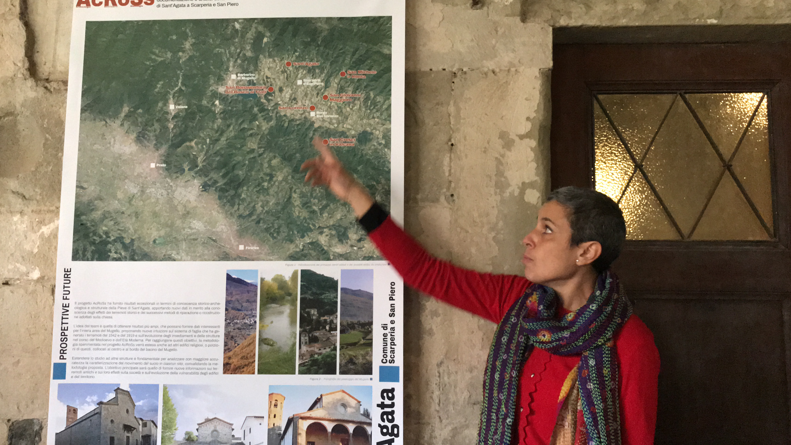
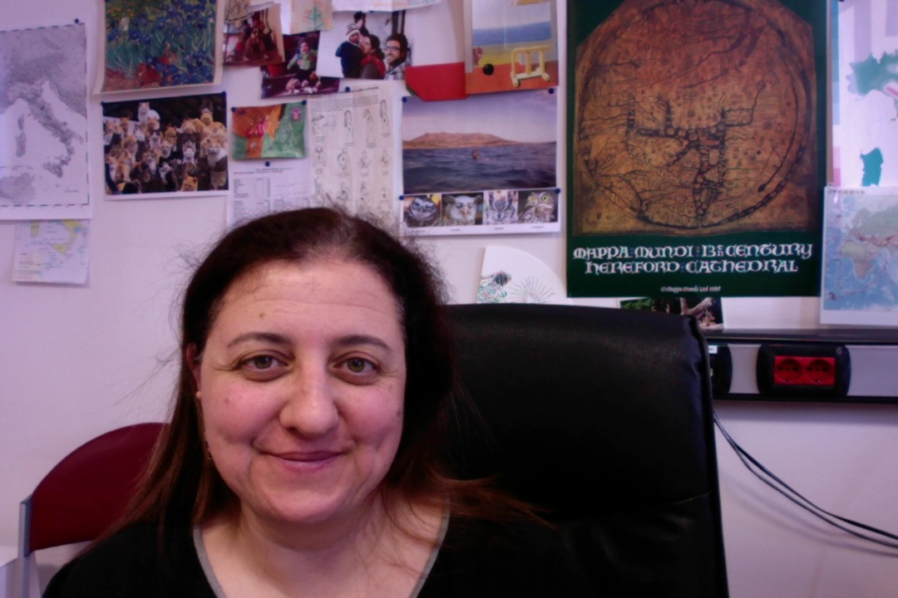

# The ACROSS consortium

Who are we?
A consortium of 5 French institutes and 4 Italian parteners!

## PI : Maria Lancieri (IRSN)

Maria Lancieri PhD (2002-2005) in seismic risk (Università degli studi di Napoli, Federico II - Italy), in her thesis she studied the influence of extended seismic rupture on spatial distribution of observed damages (supervision of A. Zollo). In early years of her career (researcher at INGV 2006-2009), she worked on the development and implementation of earthquake early warning systems (EEW), conducting pioneering studies on Bayesian method to predict event magnitude on the basis of early seconds of seismic records (in collaboration with A. Zollo, G. Festa and S. Nielsen). Captivated by the debate on the deterministic nature of seismic
 rupture triggered by her findings, she moved to France to deeper her knowledge on the seismic source, working on the spectral properties of Tocopilla (M 7.7) Northern-Chile seismic sequence. In particular she investigated the self-similar behaviour of the seismic source and its impact on magnitude prediction models for EEW (in collaboration with R. Madariaga, ENS Paris). Since 2010 she is seismologist at IRSN. Her research domain is the engineering seismology; she works at the interface between seismic hazard and structural dynamic analysis (in collaboration with P. Bazzurro IUSS Pavia Italy, and P. Gueguen ISTerre). Since 2017 she is coordinating the Sant’Agata del Mugello ENS-IRSN project ensuring the interface between disciplines. During her career she participated to EU and ANR projects (SAFER, DEBATE, SINAPS@). She was the IRSN referent in PIA SINAPS@ (2013-2018) managing both scientific and administrative tasks.

## WP1 leader: Hélène Dessale (ENS - PSL AOROC)
Associated professor in archaeology at ENS. She has been PI of the ANR RECAP project (2015-2019), the EU project “Culture 2000” (2003-2004), and the research program PEPS PSL-CNRS on the Villa of Diomedes (2013) in Pompeii.

## Cecilia Ciuccarelli (INGV)

I’m a historian and I’m researcher in the Bologna's branch of the INGV, the Italian National Institute of Geophysics and Volcanology. My main study subjects are the historical Seismology and the historical Volcanology. For over twenty years I have been investigating the historical earthquakes occurred in Italy from the Antiquity to the contemporary years. 
The research and critical analysis of written historical sources provide us information on several aspects concerning the effects of past earthquakes. Therefore the historical seismology is a multidisciplinary field aimed to highlight the complexity of the seismic dynamics and the impacts on the human works, the natural environmental, the life of the affected communities, and the history and vulnerability of the architectural heritage, due to the damage suffered by the monuments. My research and my studies therefore oft lead me to interact with the experts of the different earth sciences fields, or of the other scientific areas and of the humanities, such as, in the case of the structural and seismic analysis of heritage buildings, archaeologists, architects, engineers and seismologists. This is a very fascinating and productive feature of my research activity. It will be a very interesting challenge for me to study and discuss the historical data about the constructive events and the seismic effects on the five bell-towers in Mugello. 

