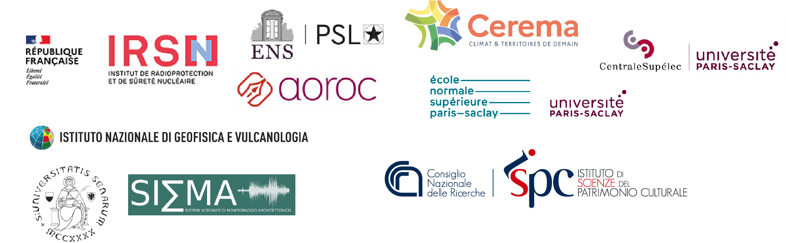

# The ACROSS consortium

Who are we?
A consortium of 5 French institutes and 4 Italian partners!

### [PI : Maria Lancieri (IRSN, France)](maria)

## WP1 Tracing the seismic history of the five bell towers

##### [WP1 leader: Hélène Dessales (ENS - PSL AOROC, France)](helened)

[Cecilia Ciucarelli (INGV, Italy)](cecilia)

[Andrea Arrighetti (UniSiena - SISMA, Italy)](andrea)

[Georgia Porsoulis (Independent researcher, France)](georgia)

[Emma Cantisani (CNR, Italy)](emma)

## WP2 Engineering analysis of the bell towers
##### [WP2 leader: Deigo Mercerat (CEREMA, France)](diego)

[Cedric Giry (ENS Paris-Saclay, France)](cedric)

[Fréderique Raguenau (ENS Paris-Saclay, France)](fred)

[Benjamin Richard (IRSN France)](benjamin) 

[Fernando Lopez-Caballero (CentraleSupélec, France)](fernando)

[Arnaud Montabert (ENS, France)](arnaud)

## WP3: Selecting and generating strong ground motion

##### [WP3 leader Céline Gélis(IRSN, France)](celine) 

[Hélène Lyon-Caen (ENS, France)](helenelc)

[Sebastien Hok (IRSN, France)](seb)

[Hervé Jomard (IRSN, France)](herve)
 
[Giacomo Corti (CNR, Italy)](giacomo)

## WP4: The aggregator

###### [WP leader: Maria Lancieri (IRSN, France)](maria)

[Yann Richet (IRSN, France)](yann)

All the parteners are involved!

