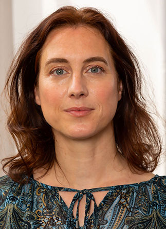

## Agnès Tricoche (ENS-PSL AOROC)

Agnès Tricoche is an engineer at the French National Centre for Scientific Research (CNRS) and member of the AOROC research unit (Archaeology & Philology of the East and West - CNRS ENS PSL). She has a PhD in history and archaeology of the ancient worlds and is a specialist in databases and digital resources, particularly applied to archaeology and ancient texts.
She is head of the Digital Humanities division of her laboratory and also coordinates the Digit_Hum initiative, which aims to promote digital humanities at the École normale supérieure de Paris (ENS).

She developed the digital infrastructure of the international ACoR program (Atlas of Roman building techniques) and put online the archives of the Villa of Diomedes in Pompeii (Villa Diomedes Project). In the framework of the ANR RECAP project (Rebuilding after an earthquake: ancient experiences and innovations in Pompeii), she built the database to characterize the ancient post-seismic repairs on the site of Pompeii, which is now integrated in the ACROSS project.

Links

[Personal webpage](http://www.archeo.ens.fr/Tricoche-Agnes.html){:target="_blank"} 

[Digit_Hum initiative](https://digithum.huma-num.fr/){:target="_blank"} 

[ACoR program](https://acor.huma-num.fr){:target="_blank"} 

[Villa Diomedes Project](http://villadiomede.huma-num.fr/bdd/){:target="_blank"} 

[ANR RECAP project](http://recap.huma-num.fr/webpublic/){:target="_blank"} 

