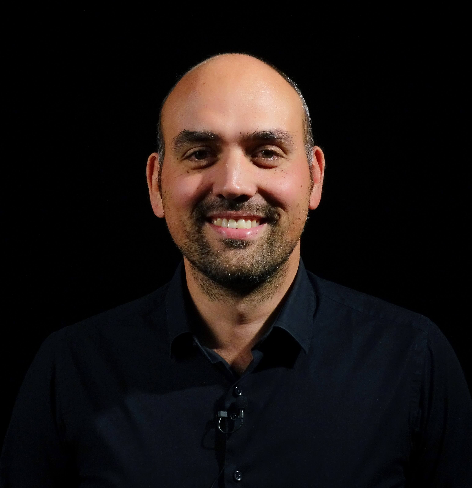

## Andrea Arrighetti (UniSiena, Univaq, Sisma)

{: width="500" }

I’m a Granted Researcher and a Ph.D. in “Medieval Archaeology” at the Human Sciences Department of the University of L’Aquila. Actually I’m also a Contract Professor in “Archaeology of Architecture” at the University of Siena and in “Methodologies of archaeological research” at the University of L’Aquila. I’m specialized in the Archaeology of Architecture, Archeoseismology and Surveying. My main interests are in the study of the construction systems of historical buildings, especially medieval buildings, in Italy and abroad, and experimenting with photogrammetry applications and Structure from Motion applications for recording Cultural Heritage. Since 2006 I have carried out, and coordinated, an intensive activity of stratigraphical studies of standing walls and elevations, and surveys, both nationally and internationally, in collaboration with Italian universities, research institutes and companies on behalf of the public and private sectors. At the european level I’m involved in three Horizon 2020 project with Italian, Russian, Spanish, Portuguese universities and companies. Since 2011 I have carried out both theoretical and practical teaching work as part of BA and MA university degree courses, Superintendency programmes, Master's degrees and Doctoral Schools in Archaeology and in Architecture, in Italy, Spain and France, relating to the Archaeology of Architecture and technologies for surveying historical buildings and the Cutural Heritage in general. I have attended, as an invited Speaker, numerous national and international seminars and conferences on the subjects of Medieval Archaeology, the Archaeology of Architecture, and New Technology applied to the Cultural Heritage.

Links
-
[SISMA](http://www.sisma2015.it){:target="_blank"}

[LAArch UniSi](http://laarchsiena.altervista.org/){:target="_blank"}