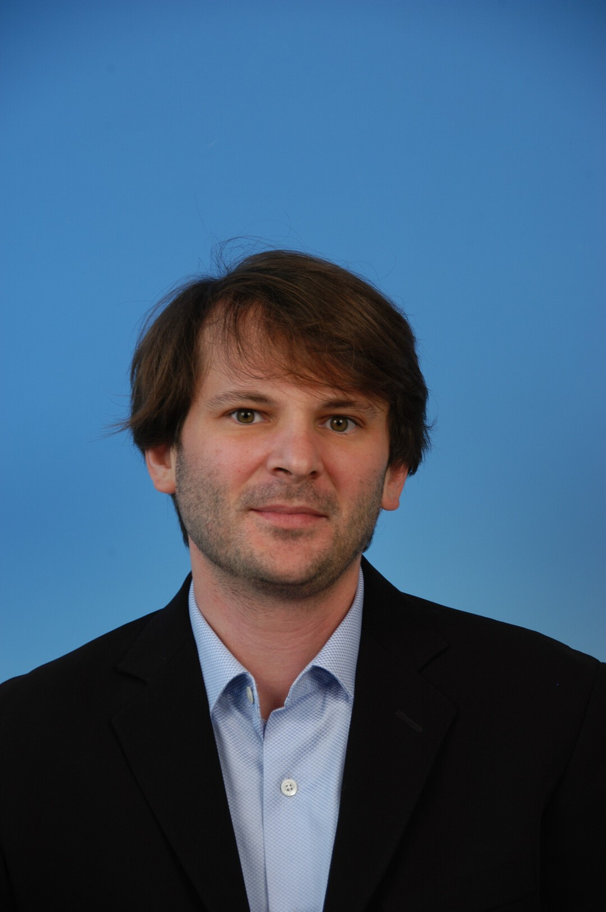

## Benjamin Richard (IRSN)

{: width="350" }

Benjamin Richard is Head of the Structural Performance Analysis and Modeling Lab at the Radioprotection and Nuclear Safety Institute (IRSN). He was a research engineer working at the French Sustainable Energies and Atomic Energy Commission (CEA) between October 2011 and July 2018. He defended his accreditation to supervise research (HDR) in November 2016.
 
He is interested in the numerical prediction of the seismic behavior of reinforced concrete structures dedicated to either civil engineering or nuclear engineering. Within the framework of research projects joining French or European major institutions working in the field of nuclear engineering, Benjamin Richard is in charge of developing efficient numerical strategies to assess the safety of complex structures regarding the seismic risk. In particular, he is interested in predicting specific nonlinear responses, such as cracking, that are of primary importance for design or safety studies.
 
Benjamin Richard is also a lecturer at Ecole Normale Supérieure de Cachan (ENS Cachan). He teaches the course entitled "seismic design of reinforced concrete and steel structures" to graduate students.
 
In 2021, Benjamin Richard was author or coauthor of more than 32 papers published in international journals and more than 39 papers presented in international conference proceedings. He is the Head of the technical and scientific committee of the French Association for Earthquake Engineering (AFPS). Benjamin Richard was awarded by different prizes in 2012, 2015 and 2017 by the World Conference in Earthquake Engineering (WCEE 2012), the French Association for Earthquake Engineering (AFPS) and the French Society of Nuclear Energy (SFEN).
