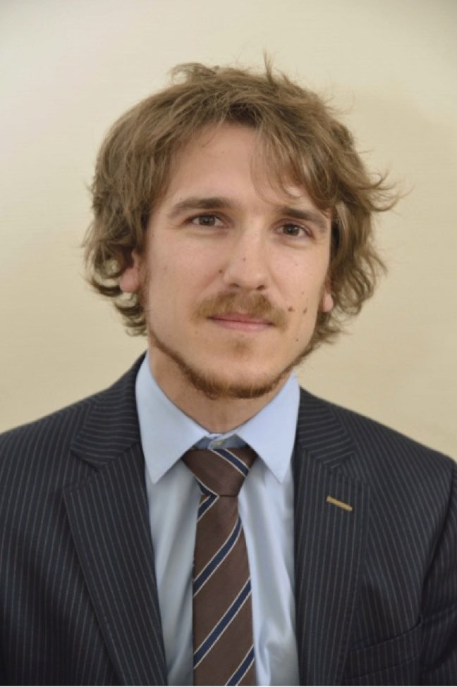

## Cédric Giry (Ecole Normale Supérieure Paris-Saclay)

{: width="200" }

Cédric Giry is associate professor at the Ecole normale supérieure Paris-Saclay, in the Civil Engineering Departement. He develops his research activities at LMT (Laboratoire de Mécanique et Technologie) on the analysis of civil engineering structures subjected to static and severe loadings (earthquake). He develops also dedicated tools for the modeling of cracking in reinforced concrete structures and old masonry. He is in charge at LMT of the Thematical Research Unit “Dynamic and behavior of civil engineering structures”.
Since the research works developed during the PhD of Claire Limoge, one of its research activities focuses on the evaluation of the seismic vulnerability of old masonry structures and more particularly cultural heritage structures. 
He has been involved in several national research project funded by the ANR: SINAPS@, THEDESCO, ILISBAR.

He teaches at ENS Paris-Saclay on several topics link to its research interests: vibrations and waves, structural mechanics, earthquake engineering, numerical methods, thermodynamical framework for the material behavior, material behavior and finite element methods.

He works also with the different members of the French earthquake engineering community as the president of the Youth group of the French association of earthquake engineering (AFPS). He leads a new working group at AFPS related to the development of a georeferenced database of the post-earthquake missions of AFPS and has been member of the AFPS mission for the study of the Teil earthquake as civil engineering expert.

Links
-
[ENS Paris-Saclay](https://ens-paris-saclay.fr){:target="_blank"}

[LMT](http://lmt.ens-paris-saclay.fr){:target="_blank"}

[AFPS](http://www.afps-seisme.org){:target="_blank"}

