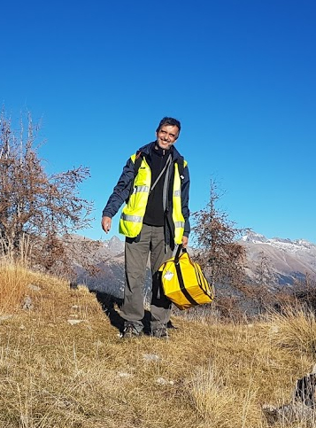

## Diego Mercerat (CEREMA)

{: width="250" }

E. Diego Mercerat seismologist at the Seismic Risk Team of CEREMA Méditerranée, received his PhD in Civil Engineering/Geomechanics in 2007 from the National Polytechnical Institute of Lorraine (Nancy, France). 

Afterward, he held postdoctoral positions at the Institut de Physique du Globe in Paris and at the University of Nice-Sophia Antipolis working in 
seismic wave propagation and tomography. 

His research interests include seismic waves modeling and inversion, seismic response of civil engineering structures and geomorphological features by operational 
modal analysis, site characterization and microzonation studies for seismic hazard assesment by means of empirical techniques based on ambient vibrations and numerical simulations of wave propagation by finite/spectral elements methods. 

Since 2011, he is a permament researcher of the French Ministry of Ecology, Sustainable Development and Energy at the Seismic Risk Team of CEREMA Méditerranée, "Repsody" teams associated to Géoazur laboratory of the Université Cote d'Azur (France). 

He is member of the scientific committee of the RAP-RESIF consortium (French Accelerometric Network). He participated in several ANR and InterReg EU projects (Remake, Sinaps@, RisVal) always at the interface between Seismology and Earthquake Engineering. 

He has recently co-supervised two PhD thesis : Simon Chabot (Numerical modeling of non-linear wave propagation, 2014-2017) and Daniel Pacheco (Seismic response of the Quito basin, 2018-2021) and collaborated with several other MSc and PhD students.

Links
-

[CEREMA REPSODY](https://www.cerema.fr/fr/innovation-recherche/recherche/equipes/repsody-reponse-sols-sites-structures-aux-sollicitations){:target="_blank"}

[ResearchGate](https://www.researchgate.net/profile/E-Mercerat-2){:target="_blank"} 