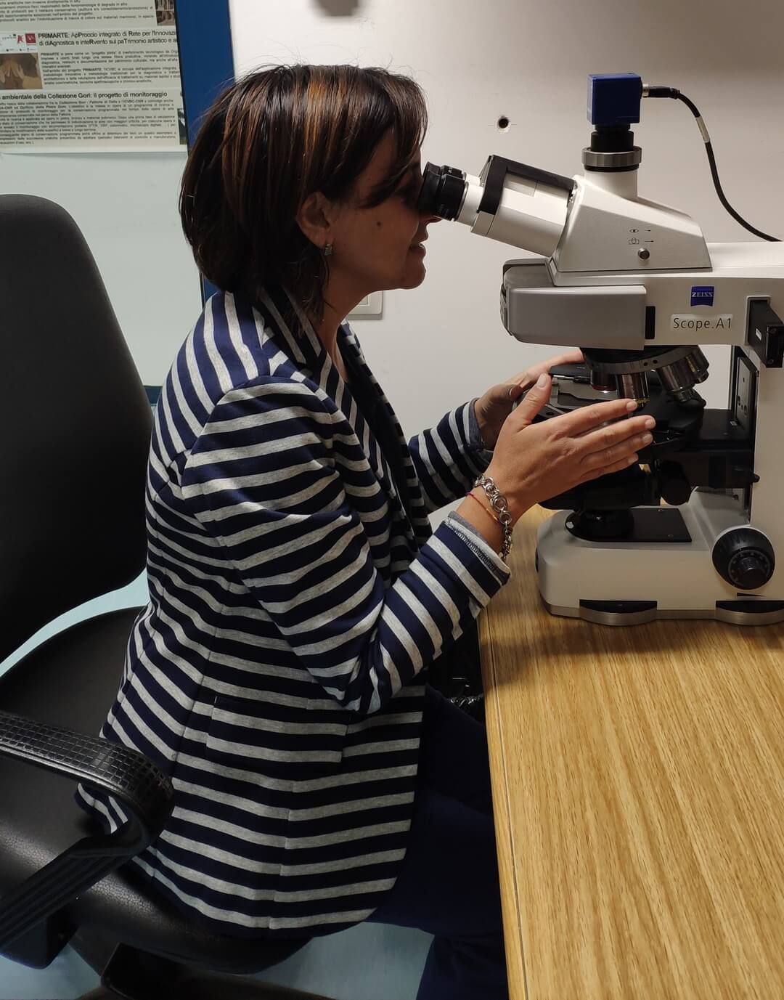

## Emma Cantisani (CNR, Istituto di Scienze del Patrimonio Culturale)

{: width="350" }

Graduate cum laude in Geological Sciences at University of Pisa (year 2009). Received the PhD title in Sciences for Conservation of Cultural Heritage at University of Firenze in 2003. 
2003-2005 Post-doc research grant at CNR Institute for Conservation and Valorisation of Cultural Heritage in the European project “ Development of integrate methodologies for the evaluation of durability of monumental stones" (McDUR Project);
2005-2008  Post-doc research grant at the University of Florence in the PRIN project “Lapideous resources to antiquity today in the Mediterranean area: cultural identities and technologies. Integrated experiments for the knowledge, conservation and restoration”;
2008-2009 Researcher with temporary position at University of Florence in the European Project “MARE NOSTRUM” - A Heritage Trail along the Phoenician maritime routes and historic port-cities of the Mediterranean Sea ( Euromed Heritage IV project);
2009-now  Permanent researcher at Institute for the Conservation and Valorization of Cultural Heritage (ICVBC) of National Research Council of Italy (CNR), from October 2019 Institute of Heritage Science (ISPC).
The main research activities are: mineralogical, petrographic, physical and mechanical characterization of natural and artificial lapideous stones; mineralogical, petrographic ad physical characterization of mortars, ceramics, bricks, vitreous materials aimed to the determination of the raw materials and to the obtainment of technological information; X ray techniques and microscopic optical and electronic techniques applied to different materials in Cultural Heritage (mortars, plasters, stones, ceramics, pigments, wood, metals)  for archaeometric and conservative purposes; study of decay mechanism of architectural materials; set up of new methodologies and products for conservation of cultural heritage; archaeometric studies on white and colored marbles, archaeometric studies on pigments, metals, glasses.
Participation to Recent National and International Projects: 2007-2013  Tecon@BC Project  “Innovative Technologies for the Conservation and Valorisation of Cultural heritage”, POR FESR project; 2012-2014  PrimArte project.  An integrated approach for the innovation in the diagnostic and restoration methods of Cultural Heritage, founded by Italian Regional Administration; 2012-2014  Hypogea project  “Origin  of calcium carbonate crystallizations on hypogean mural paintings” founded by Commissione Pontificia di Arte Sacra (Rome, Italy); 2012-2015 Ecocement project, founded by European Commission FP 7  “Novel bio-mimetic technology for enzyme-based microbial carbonate precipitation through the revalorization of industrial waste as raw materials, in order to produce eco-efficient environmentally friendly cement”.
2013-2016 Coordination of research unit of ICVBC CNR in the  FIRB MIUR 2012 project  “Marmora Phrygiae, interdisciplinary methodologies for knowledge and preservation. Archaeology of architecture, information technologies and chemical-physical sciences for the historical reconstruction of building sites and the supplying of stones in a Roman and Byzantine city of Asia Minor, Hierapolis of Phrygia” (2013-2016).
2017- 2020 Coordination of CNR  bilateral project “Wet archaeological wooden material: multi-analytical approach for decay diagnosis” with PAS (Polish Academy of Sciences), Poland.
2020-2022 Participation to Smart4CH2 project “Interoperable platform for the management and predictive conservation of cultural heritage through integrated enabling technologies”.

Links
-
[Istituto di Scienze del Patrimonio Culturale](https://www.ispc.cnr.it/en/)

