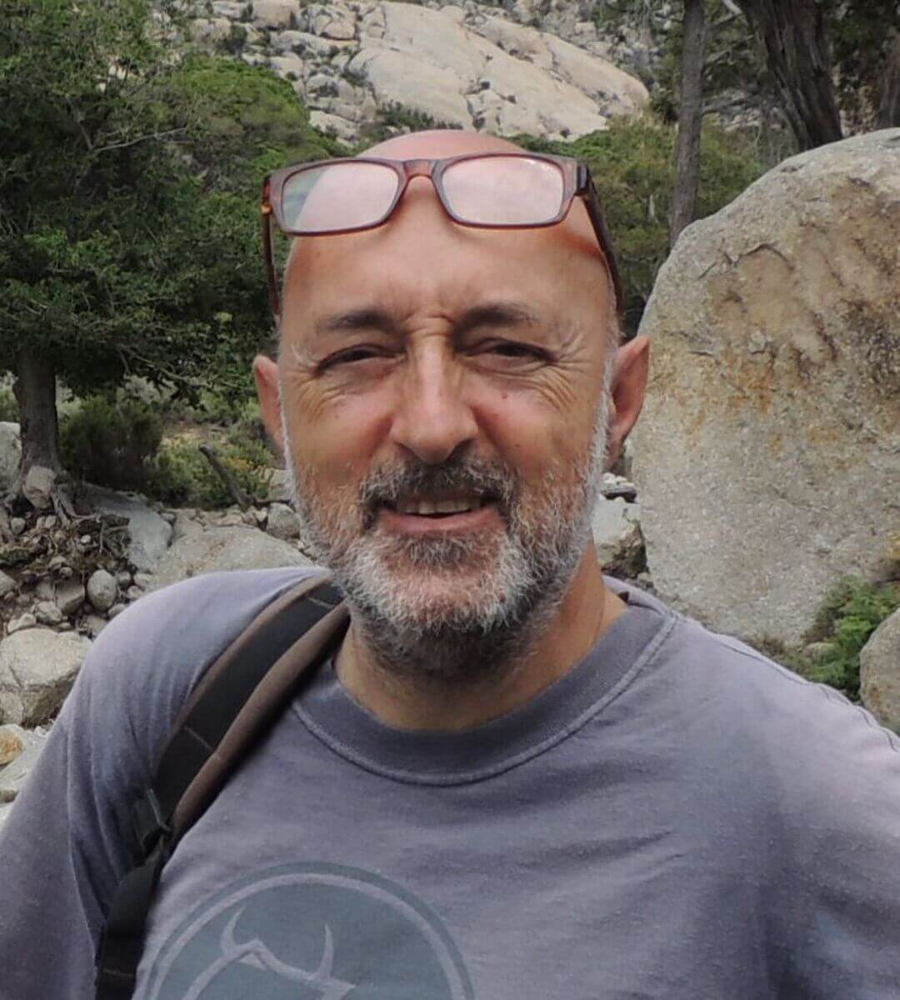

## Fabio Fratini (CNR, Istituto di Scienze del Patrimonio Culturale)

{: width="350" }

Graduated in Geological Sciences at the University of Florence in 1982, since 1984 researcher in the Italian National Research Council (CNR) - Institute for Heritage Science of Florence. His research activity deals with archaeometric investigation on stone materials, bricks, "terracotta", archaeological findings, earthen materials and mortars utilised in architecture aimed to understand the production technology, provenance and problems of decay and to plan conservation interventions. The researches have produced more than 320 scientific papers.
Since 1985 he participates to the activity of the UNI Committee for the standardisation of the analytical methodologies utilised in the characterisation of ancient mortars and stone materials utilised in architecture. He is member of the Scientific Council of the Congress "Science and Cultural Heritage" which takes place in Brixen  since 1985.
He participated in many national and European Projects, he has been coordinator, with the Pontifical Commission for Sacred Archaeology, of a project for the study of the development of carbonate deposits on the wall paintings in the Roman catacombs. He taught in different courses organised by Institutions like Bozen Province, International University of Art of Florence, the Department of Architecture of the University of Florence, the College of Engineers of Tuscany. From 2009 to 2011 he has been teacher of Archaeometry at the degree in Archaeology of the University of Siena. 

Links
-
[Istituto di Scienze del Patrimonio Culturale](https://www.ispc.cnr.it/en/)