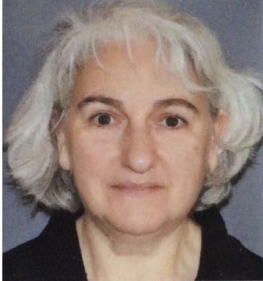

## Georia Poursoulis (La Memoire des Lieux, independent consultant)
{: width="150" }

Dr in History and Archaeology, specialised in Archaesoseismology : the research of seismic traces on the historical buildings.

PhD on the Destruction of the Minoan Palaces in Crete (Greece), obtained in 1999 at Paris I Panthéon-Sorbonne.

DPEA construction parasismique of Ecole Nationale Supérieure d’Architecture de Marseille Luminy in 2009.

President of the APS Group (Archaeology- Pathologies-Seismicity), work on the 1708 earthquake traces in Manosque and the surroundings from 2001 to 2006.

Co-Editor with Agnès Levret-Albaret in 2016 of the 1708 Manosque earthquake: contribution of a historical and archaeological study to the evaluation of the seismic risk in Middle Durance.

Member of the AFPS (Association Française du Génie Parasismique), expert in archaeoseismology on the Post-Seismic Mission in l’Aquilla Italy, after the 2009 earthquake.

Work for the GIP Les Grands Ateliers de l’Isle d’Abeau, as project manager of the major risks division from 2007 to 2011.

Work as Engineering and design office (DIA-gnossis Engineering)

- In 2010 for: Seismic analysis of an earthen building Morocco 

Work for EDF as archaeoseismologist free lance:

- In 2013 for Architectural study on the impact of the historical earthquakes of the Entre-deux-Mers of August 10th 1759 and January 26th 1852 on the old buildings, Better estimation of macro-seismic intensity values.
- In 2017 for Architectural Study on *Improvement of the knowledge of the earthquake of 1889*, location supposed at La Tour du Pin.

Work for the Ecole Nationale d’Architecture de Grenoble laboratoire CRATerre 

- in 2014 for: Research on traditional para-sinister building cultures.

Work for the BRGM (Bureau de Recherches Géologiques et Minières) as archaeoseismologist free lance:

- In 2020 for: Documentary research and Archaeoseismic Study on the earthquakes of 1426 and 1832, in Saudi Arabia.

Links
-
[La memoire des lieux](http://www.la-memoire-des-lieux.fr){:target="_blank"}
