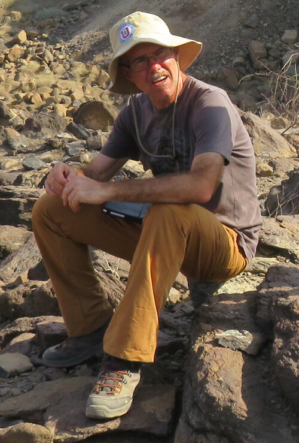

## Giacomo Corti (CNR)

{: width="250" }

I am a Research Director at the Institute of Geosciences and Earth Resources of the National Research Council of Italy, and head of the Florence Research Unit of the same Institute. I received a MsC-equivalent degree (Laurea) in Geology at the University of Florence (1997) and a Ph.D. in Mineralogy and Petrology at the University of Pisa (2003). My research currently focuses on continental extensional tectonics, with special interest on the evolution of the East African Rift System; this research integrates field geological-structural studies, analogue modelling and geophysical data. My scientific interests also include the analysis of the active tectonics of the Northern Apennines, and analogue modelling of deformation processes at various scales, including continental collision, strike-slip deformation, multiphase deformation, magma emplacement, geomorphic processes (e.g., ice flow dynamics). I am also involved or have been involved in projects analysing the evolution of the Gulf of California (Mexico), evolution of the Baikal Rift (Russia), the processes of ice flow and meteorite accumulation in the Antarctic ice, the Quaternary magmatism of the Tuscan Magmatic Province and the tectonics of Central America (El Salvador).
I am the author or co-author of ca. 100 peer-reviewed publications in some of the most important international journals (Nature Geoscience, Nature Communications, Geology, Earth Science Reviews, Journal of Geophysical Research, Earth and Planetary Science Letters, Tectonics, Tectonophysics, etc), and more than 100 presentations at international or national congresses. I am the author of the divulgative book "Geologia e paesaggi della rift valley in Etiopia (Geology and landscapes of the Ethiopian Rift Valley)" (Pacini Editore, Pisa, 2012). I have recently organized the congress 'Il terremoto del 29 Giugno 1919 e la sismicità in Mugello' (the 1919 June 29th earthquake and the seismicity in Mugello) I cooperate with several schools and local institutions in the field of divulgation activities aimed at increasing awareness of seismic risk in the population and took part to TV and Radio shows.

Links
-

[Giacomo Corti's list of publications (and citations) on Google Scholar](https://scholar.google.it/citations?user=__UbzRgAAAAJ){:target="_blank"}

[Researchgate](http://www.researchgate.net/profile/Giacomo_Corti/){:target="_blank"}

