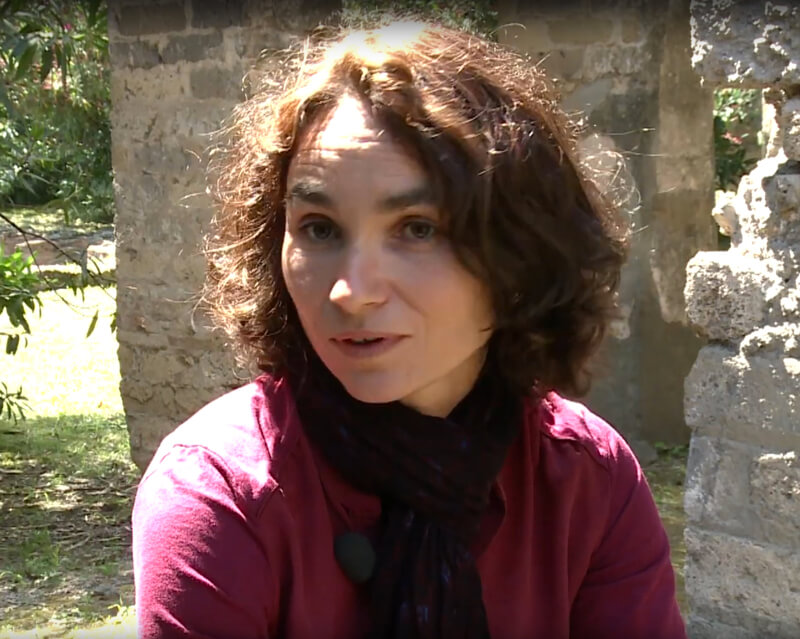

## Hélène Dessales (ENS-PSL AOROC)

Hélène Dessales is lecturer in Roman archaeology at the Ecole normale supérieure, in the Département des Sciences de l’Antiquité, as a member of the AOROC research unit. She was fellow of the Ecole française de Rome and junior member of the Institut Universitaire de France. Her research focuses on building techniques in the Roman world. She is also a specialist in the history of archaeology, studying graphical archives of the 19th century, through the corpus of the “Grand Tour” travellers in Italy. She has led several field missions, in France, Spain and Italy. In Pompeii in particular, she has recently coordinated various research projects (PSL structuring program - Pompeii 3D; ANR RECAP - Rebuilding after an earthquake: ancient experiences and innovations in Pompeii) and published a volume on a significant monument (The Villa of Diomedes. The making of a Roman villa in Pompeii, Paris, 2020). 

Links
-

[AOROC](http://www.archeo.ens.fr/?lang=fr) 

[Villa di Diomede PSL Program](https://explore.psl.eu/fr/decouvrir/focus/villa-de-diomede-pompei-la-fabrique-dune-villa-romaine)

[Villa di Diomede Project](http://villadiomede.huma-num.fr/3dproject/?lang=fr)

[ANR RECAP](http://recap.huma-num.fr/webpublic/?lang=fr)

