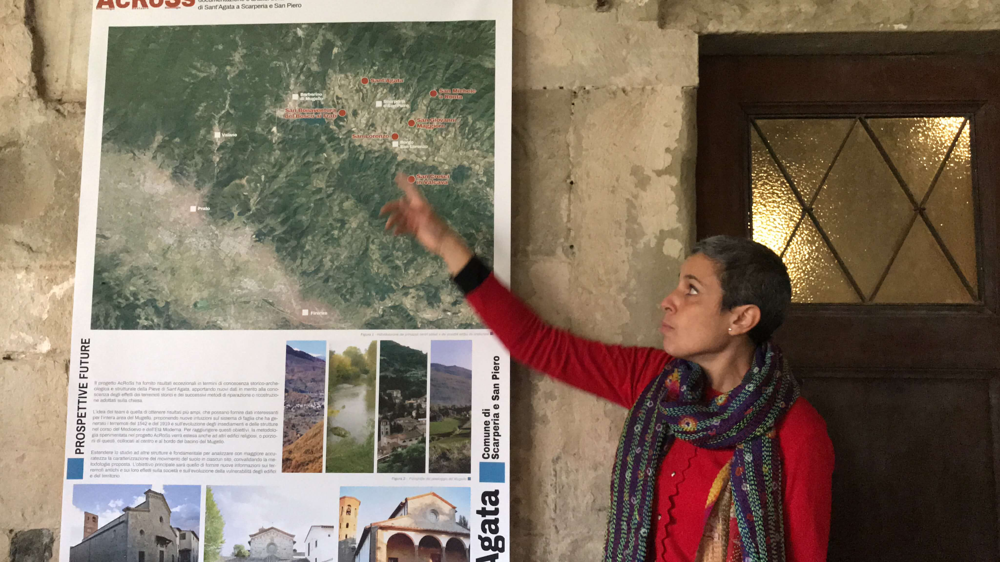

## PI : Maria Lancieri (IRSN)

Maria Lancieri PhD (2002-2005) in seismic risk (Università degli studi di Napoli, Federico II - Italy), in her thesis she studied the influence of extended seismic rupture on spatial distribution of observed damages. In early years of her career (researcher at INGV 2006-2009), she worked on the development and implementation of earthquake early warning systems (EEW), conducting pioneering studies on Bayesian method to predict event magnitude on the basis of early seconds of seismic records. Captivated by the debate on the deterministic nature of seismic
 rupture triggered by her findings, she moved to France to deeper her knowledge on the seismic source, working on the spectral properties of Tocopilla (M 7.7) Northern-Chile seismic sequence. In particular she investigated the self-similar behaviour of the seismic source and its impact on magnitude prediction models for EEW. Since 2010 she is seismologist at IRSN. Her research domain is the engineering seismology; she works at the interface between seismic hazard and structural dynamic analysis. Since 2017 she is coordinating the Sant’Agata del Mugello ENS-IRSN project ensuring the interface between disciplines. During her career she participated to EU and ANR projects (SAFER, DEBATE, SINAPS@). She was the IRSN referent in PIA SINAPS@ (2013-2018) managing both scientific and administrative tasks.
 

Links
-
[BERSSIN](https://www.irsn.fr/FR/Larecherche/Organisation/equipes/environnement/Berssin/Pages/Bureau-evaluation-risques-sismiques-surete-installations.aspx#.YFj9ty1aYWo)

[Earthquakes and NPP](https://www.irsn.fr/FR/connaissances/Installations_nucleaires/La_surete_Nucleaire/risque_sismique_installations_nucleaires/Pages/sommaire.aspx#.YFj99y1aYWo) In French

 

