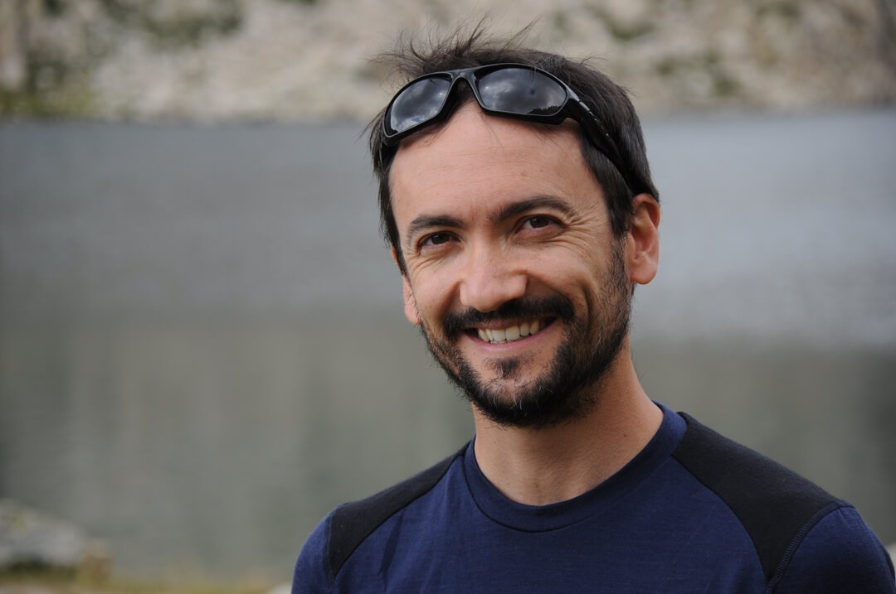

## Sebastien Hok (IRSN)

{: width="500" }

I study earthquake rupture dynamics using 3D numerical models of faults (using HPC codes). After broad Earth sciences education (University of Nice, ENS Lyon, France), I got my PhD in geophysics from Grenoble, France, University in 2008. In my thesis, I investigated two physical mechanisms that reduce the fault dynamics and contribute to the arrest of rupture spontaneous propagation: off-fault damage and spatial variations of frictional properties along the fault. Combined together, those processes both reflecting faults reality can explain the magnitude-frequency distribution of earthquakes. Hired as a research fellow at NIED, Tsukuba, Japan (2008-2011), and then at ENS, Paris, France (2011-2012), I worked at developing new modelling tools for reverse fault rupture. I also developed and applied methodologies to construct data-informed scenarios of spontaneous rupture for large earthquakes in Japan (2008 Iwate-Miyagi-Nairiku crustal earthquake and rupture scenarios for the Nankai and Tohoku subduction zones). Those data-informed scenarios are necessary to both better understand earthquake processes and anticipate future hazards. At IRSN since 2013, I continue to draw bridges between earthquake geology and seismic hazard through fault rupture physics, especially targeting 2 aspects : 1) improving the earthquake rupture knowledge and models (from data or physics constraints) to make them reliable and usable for hazard assessment as scenarios or ground motion sources, and 2) developping physics-based ground motion models for hazards (transient shaking or permanent fault surface ruptures). I have been working on multi-fault rupture scenarios, surface rupture modelling, physics-based ground motion validation. I was PI of ANR AGIR project, and participated or participate to several others (DYNTOHOKU, SISCOR, SINAPS@, DISRUPT, EQTIME). From time to time, I leave my supercomputer to become an enthusiastic field geologist / seismologist or a passionate earthquake hazards lecturer.

